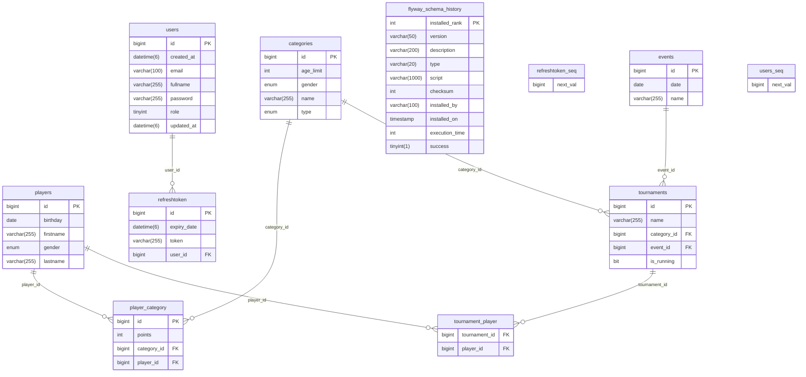

#  TTT - Table Tennis Tournaments

Web app for managing table tennis tournaments, featuring real-time updates, user roles, CRUD operations and validation, built with Spring Boot and React.

🌐 LIVE Demo: http://141.144.247.230/

Todo:
- Change domain name
- Add SSL certificate

## 🎥 Preview

[](https://www.youtube.com/watch?v=NyZq1Duw8SI)

## 📋 Description

TTT is a web application that allows the creation of tournaments and players. Unauthorized users can follow live results through the use of WebSocket technology. Authorized users can subscribe to an event to get notifications of all game results in tournaments within the subscribed event. A moderator can manage (CRUD operations): players, events, and tournaments. Sending match results is thoroughly validated on the client side and server side. An administrator can manage other users (change permissions and delete accounts). Creating a player automatically assigns the appropriate age category. Tournaments are Single-Elimination (the application is designed in a way that allows further expansion with further tournament forms such as Double-Elimination and with different types of matches, such as doubles games). To seed players in tournament brackets, I used the algorithm of the "Serpentine System"(https://en.wikipedia.org/wiki/Serpentine_system). The players are ranked based on points in the proper category.


## ⚙️ Technologies


### 🔧 Backend
- **Spring Boot**: Framework for building Java applications.
- **Spring Data JPA**: Simplifies data access layers.
- **Hibernate**: ORM tool for Java.
- **Spring Security**: Provides security features.
- **MySQL**: Relational database management system.
- **JWT**: JSON Web Tokens for authentication.
- **Flyway**: Database migration tool.
- **Sendgrid**: Email delivery service.
- **WebSockets**: Enables real-time communication.

### 🖥️ Frontend
- **React.js**: JavaScript library for building user interfaces.
- **Vite**: Build tool for modern web projects.
- **Bootstrap**: CSS framework for responsive design.
- **MUI**: React component library based on Material Design.
- **Formik / Yup**: Form handling and validation.
- **Motion**: Animation library for React.

## 🌟 Features
- User registration and login
- Confirmation Email / Reset password
- Role-based Authentication JWT
- Rest Api / Websocket
- CRUD (Create, Read, Update, Delete) 
- Client-side Pagination and Filtering
- Validation forms
- Error handling

## 🚀 How to run (locally)


1. **Navigate to the main directory**
    ```bash
    cd TournamentsTableTennisWeb
    ```

2. **Create .env.dev file and complete content**

   - .env
   
    ```
    MYSQL_DATABASE=
    MYSQL_USERNAME=
    MYSQL_ROOT_PASSWORD=
    
    SPRING_DATASOURCE_URL=jdbc:mysql://mysql:3306/${MYSQL_DATABASE}
    SPRING_DATASOURCE_USERNAME=${MYSQL_USERNAME}
    SPRING_DATASOURCE_PASSWORD=${MYSQL_ROOT_PASSWORD}
    
    SENDGRID_API_KEY=
    JWT_SECRET_KEY=
    ```

  
   >  **How to get JWT_SECRET_KEY?** You can Generate random 256-bit key here: [Generator]( https://generate-random.org/encryption-key-generator?count=1&bytes=32&cipher=aes-256-cbc&string=&password=)
   
   >   **How to get SENDGRID_API_KEY?** You can Generate api key here: [SendGrid](https://sendgrid.com/en-us). [Tutorial](https://www.youtube.com/watch?v=Waty-a586hk)


3. **Run docker**

    ```bash
    docker-compose -f docker-compose-dev.yml up --build
    ```
   
To get access default Admin account:
- Email: `admin@admin.com`, 
- Password: `admin`

Client: http://localhost:3000/

Api: http://localhost:8080/swagger-ui.html


## 🗂️ Schema Database




